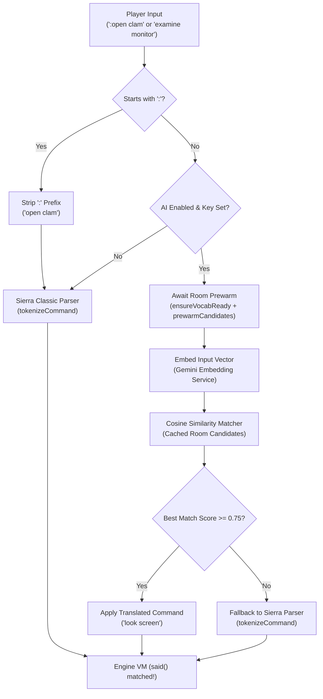

# AI Semantic Command Parser Architecture

This document describes the design, caching mechanisms, deduplication algorithms, and lifecycle synchronization of the AI-assisted natural language command parser in the Sierra engine workbench, and outlines how this subsystem extends from AGI to SCI (SCI0 / SCI1-EGA).

---

## 1. Overview & Goal

Classic Sierra adventure games require strict text input matching predefined vocabulary words and phrase structures (e.g. `said("look", "screen")`). Players often struggle with vocabulary guessing (synonym hunting, typing colloquialisms like *"could you please examine the terminal monitor"* or *"pet kitty"*).

The AI Semantic Parser provides **hybrid natural-language understanding**:
1. It statically extracts all valid command patterns (`said(...)`) present in the active room and global scripts.
2. It expands these patterns using semantically deduplicated game vocabulary into candidate phrases.
3. It maps the player's natural language input to high-dimensional embedding vectors using the Google Gemini Embeddings API (`text-embedding-004` or `gemini-embedding-001`).
4. It performs cosine similarity matching against the active candidates. If a candidate exceeds the similarity threshold (default `0.75`), it translates the player's input into the exact matching candidate phrase (e.g., `"look woman"` or `"get fly"`).
5. If no candidate meets the threshold, it seamlessly falls back to Sierra's classic parser (`tokenizeCommand`).
6. **Direct Parser Bypass (`:command`)**: If player input begins with a colon (e.g. `:look screen` or `: get clam`), the AI translation layer is completely bypassed, and the command is stripped of the `:` prefix and fed directly to the raw Sierra parser. This allows players to immediately bypass AI matching for difficult syntax or snags without turning off the AI feature.



---

## 2. Core Subsystems & Algorithms

### 2.1 Vocabulary Deduplication & Prototype Selection (`SemanticMatcher`, `AgiDictionary`)

Sierra's vocabulary tables (`WORDS.TOK` in AGI, `VOCAB.000` in SCI) map synonyms to numeric word group IDs. However, Sierra groups present unique semantic challenges:
- **Overloaded Groups**: Distinct entities are frequently bundled together into a single group to save table memory (e.g., King's Quest 2 Group 18 bundles `girl`, `woman`, `witch`, `fairy`, `mermaid`, `grandma`, `valanice`, as well as period-typical profanities and slurs).
- **Multiple High-Frequency Verbs**: Common actions like taking an item group `take`, `get`, `catch`, `pick up`, and `capture` under one ID (e.g., KQ3 Group 14).
- **Profanities and Obscenities**: Sierra game designers notoriously included easter-egg obscenities in dictionary groups (e.g., `sperm burping gutter slut`, `cunt`, `tit`, `fart`).

To transform these raw groups into clean, representative candidate phrases, `GeminiCommandTranslator.deduplicateDictionary()` and `SemanticMatcher.deduplicateWordsSemantically()` execute a multi-phase clustering process:

#### A. Embedding Geometry & Cluster Threshold (0.88)
In Gemini embedding space, unrelated or arbitrary English phrases have a baseline cosine similarity of **~0.71–0.74**. If a naive clustering threshold (such as 0.70) is used:
- Distinct concepts (like `girl` vs `woman`, or `take` vs `get`) will erroneously collapse together.
- Conversely, obscure slurs with low cosine similarity to the main word can survive as "unique" prototypes.

Setting `SemanticMatcher.defaultClusterThreshold = 0.88` ensures that only true synonyms (e.g., `damsel` into `girl`, `hag` into `witch`, `grab` into `take`) are collapsed, preserving semantically distinct entities.

#### B. Priority Ranking & Anti-Slur Heuristic (`AgiSaidExtractor.compareWordPriority`)
Before clustering, words within each group are sorted by linguistic quality and frequency:
1. **Protected Preferred Words**: Curated lists of primary AGI verbs and nouns (`take`, `get`, `catch`, `look`, `examine`, `eat`, `drink`, `girl`, `woman`, `witch`, `fairy`) are given highest priority (ranks 1–30).
2. **Clean Single-Word Tokens**: Standard single-word dictionary terms are ranked next by string length (shorter tokens preferred).
3. **Phrases & Hyphenated Tokens**: Multi-word tokens (`pick up`, `look in`) receive a penalty offset (+20,000).
4. **Obscenities & Slurs**: Known slurs and vulgarities receive a heavy penalty offset (+50,000), guaranteeing they are placed at the bottom of the evaluation list and **never become cluster centroids or canonical representations**.

#### C. The Preferred Word Invariant
If a single Sierra group contains multiple preferred words (for example, KQ3 Group 14 contains both `take` and `get`, or KQ2 Group 18 contains `girl` and `woman`):
- **Preferred words are never clustered into each other**, even if their cosine similarity exceeds 0.88.
- Each preferred word becomes an independent centroid/prototype.
- Non-preferred synonyms cluster into the closest matching preferred prototype (e.g., `grab` and `pick up` cluster into `take`/`get`; `damsel` clusters into `girl`).

### 2.2 Said Pattern Extractor (`AgiSaidExtractor`)

The extractor inspects logic script bytecode ASTs to extract all `SaidInstruction` nodes across active scripts:
1. **Script Composition**: Combines `Logic 0` (global verbs, items, system commands), active room logic, and any dynamically loaded overlay scripts (e.g., KQ3 `Logic 104` for cat behavior).
2. **Candidate Phrase Expansion**:
   - For each word group in a `said(group1, group2, ...)` instruction, all deduplicated prototypes for that group are permuted via Cartesian product.
   - The canonical phrase (computed via `chooseCanonicalWord`) is guaranteed to appear first.
   - The candidate list is bounded by `defaultMaxCandidates = 20` (up from 15), providing enough headroom for multiple preferred verbs (`take fly`, `get fly`, `catch fly`) without causing combinatorial explosion or excessive embedding costs.

### 2.3 Direct Candidate Matching vs Canonical Target Translation

When a player types a natural language command:
1. The input vector is compared against all active candidate embeddings.
2. If candidate $C$ wins (e.g. `"get fly"` with similarity $0.988 \ge 0.75$), the translator sets `targetCommand = C`.
3. Rather than forcefully re-mapping $C$ back to an arbitrary single "canonical" command (`"take fly"`), the system submits `"get fly"` directly to the AGI text parser.
4. Because `"get"` and `"fly"` map to valid group IDs (`14` and `35`), the Sierra VM matches `said(14, 35)` natively, and the player sees their exact phrasing reflected in feedback: `AI: "get fly"`.

---

## 3. Case Studies: KQ2 and KQ3 Synonym Collisions

### Case 1: King's Quest 2 Room 9 (`look woman` vs `look girl`)
- **Problem**: In KQ2 Room 9, typing `"look at the girl"` or `"look at the damsel"` matched `"look girl"`. But typing `"look at the woman"` fell back to plain `"look"`.
- **Cause**: Sierra Group 18 contained `girl`, `woman`, `witch`, `fairy`, `mermaid`, and numerous obscenities. Under early 0.70 threshold clustering without priority sorting, `woman` was collapsed into `girl`, while profanities were preserved as distinct clusters. Candidate generation thus omitted `"look woman"`.
- **Resolution**:
  - `SemanticMatcher` protects `woman` and `girl` as independent prototypes.
  - Candidate generation produces both `"look girl"` and `"look woman"`.
  - Anti-slur heuristics ensure profanities are excluded from prototype selection.

### Case 2: King's Quest 3 Room 1 (`get the fly` matching `use fly`)
- **Problem**: In KQ3 Room 1, typing `"take the fly"` matched `"take fly"` (score 0.932), but typing `"get the fly"` incorrectly matched `"use fly"` (score 0.923).
- **Cause**:
  - KQ3 Group 14 contained `[capture, catch, get, pick, pick up, take]`.
  - Deduplication collapsed Group 14 down to just `["take"]`, omitting `"get fly"` from candidate generation.
  - Logic 0 contains global spell logic `said(144, 35)` (`use fly / fly wings`).
  - In Gemini embedding space, `"use fly"` and `"take fly"` are very close (cosine similarity **0.9425**).
  - When the player typed `"get the fly"`, since `"get fly"` was missing, `"get the fly"` was compared against `"use fly"` and `"take fly"`. Due to semantic proximity, `"use fly"` scored 0.923 and won over `"take fly"`.
- **Resolution**:
  - `take`, `get`, and `catch` are protected as preferred verbs. Group 14 preserves all three.
  - Candidate generation for `said(14, 35)` includes `"take fly"`, `"get fly"`, and `"catch fly"`.
  - `"get the fly"` directly matches `"get fly"` with >0.985 similarity.

### Case 3: King's Quest 2 Room 22 (`get the clamshell` matching `open clam`)
- **Problem**: In KQ2 Room 22 (the beach with a clam), typing `"get the clamshell"` matched `"open clam"`. The game responded: *"You must get the clam first!"*
- **Cause**:
  - KQ2 Group 59 contained `[clam, clam shell, clamshell, shell]`.
  - Because neither `shell` nor `clamshell` was on the protected preferred list, greedy deduplication collapsed Group 59 down to only `["clam"]`.
  - The candidates generated for Room 22 only included `"take clam"`, `"get clam"`, and `"open clam"`. No candidate contained `"clamshell"` or `"shell"`.
  - In modern embedding corpora, the word "clamshell" has strong packaging/device connotations ("open clamshell packaging", "open the clamshell").
  - Comparing `"get the clamshell"` against `"get clam"` vs `"open clam"` resulted in `"open clam"` winning slightly due to the "clamshell" $\leftrightarrow$ "open" contextual bias.
- **Resolution**:
  - Expanded `preferredAgiWords` to protect distinct adventure nouns (`clam`, `shell`, `clamshell`, `ocean`, `beach`, `sand`, `steps`, `hat`, etc.) alongside verbs.
  - Enforced `isDemotedWord()` checks so obscenities and slurs are never retained in prototypes or emitted in candidate phrases.
  - Room 22 candidates now generate `"get clamshell"`, `"take clamshell"`, `"open clamshell"`, `"take shell"`, `"get shell"`, `"open shell"`, etc.
  - Typing `"get the clamshell"` matches `"get clamshell"` directly with >0.985 similarity, correctly acquiring the item.

---

## 4. On-Disk Persistence & Int8 Quantization

To eliminate runtime latency and avoid repetitive API costs, embeddings are persisted in `<gameDirectory>/ai_cache/<model>/`:

```
<gameDirectory>/
  ai_cache/
    gemini-embedding-001/
      vocab.json              # Deduplicated vocabulary prototypes (~3 KB)
      logic_0.json.gz         # Int8-quantized + Gzipped candidates (~450 KB)
      logic_1.json.gz         # Int8-quantized + Gzipped room candidates (~55 KB)
      ...
```

### Int8 Quantization & Gzip Compression
- **Quantization**: Because Gemini embeddings are cosine unit-normalized ($\sum v_i^2 = 1.0$), each coordinate $v_i \in [-1.0, 1.0]$ is scaled to an 8-bit signed integer via $(v_i \times 127.0).\text{round}()$.
  - Stored in an `Int8List` and Base64-encoded.
  - 768-dimension float array shrinks from ~17.3 KB of JSON text to 768 raw bytes (1,024 Base64 chars).
  - Dequantization scales by $1 / 127.0$ and normalizes to unit length.
  - Mean cosine similarity reconstruction error is **$\le 0.0026$**, negligible against the 0.75 threshold.
- **Gzip Compression**: Compresses payload with `gzip.encode` into `logic_<id>.json.gz`.
- **Total Footprint Reduction**: **~97% reduction** (e.g. `logic_0` reduced from 15 MB down to ~450 KB).

---

## 5. Lifecycle & Synchronization Guarantees

1. **Vocabulary-First Ordering (`ensureVocabReady`)**:
   - `prewarmCurrentRoomCandidates()` and `precomputeAllRoomCaches()` always await `ensureVocabReady()` before generating candidate phrases.
   - Prevents startup race conditions where `Logic 0` was extracted and embedded before dictionary deduplication had completed.
2. **Overlay Logic Scripts Tracking**:
   - Sierra games dynamically load helper scripts for NPCs or sub-scenes (`_loadedLogicNumbers`).
   - `AgiSaidExtractor.extractActiveRoomCommands()` accepts `additionalLogics` and merges overlay script `said(...)` specifications into the active room pool.
   - Dynamic loading (`loadLogic`) triggers an automatic background pre-warm for newly loaded scripts.
3. **No Early Bypass**:
   - `submitCommand` awaits in-flight room prewarm futures before evaluating semantic similarity. Player input submitted immediately upon room transition will wait for candidate readiness rather than bypassing AI.

---

## 6. Extending to SCI (SCI0 & SCI1-EGA)

The core AI translation architecture is engine-agnostic and designed for shared reuse in SCI:

| Component | AGI Implementation | SCI0 / SCI1-EGA Counterpart | Reusability |
|---|---|---|---|
| **Embeddings & Client** | `EmbeddingService` | Shared directly | **100% Shared** |
| **Semantic Matcher** | `SemanticMatcher` | Shared directly | **100% Shared** |
| **Disk Cache & Int8 Gzip** | `AiDiskCache` | Shared directly (`ai_cache/<model>/`) | **100% Shared** |
| **Translator Orchestrator** | `GeminiCommandTranslator` | Shared directly | **100% Shared** |
| **Vocabulary Source** | `WORDS.TOK` via `AgiDictionary` | `VOCAB.000` via `SciDictionary` | Sibling dictionary parser mapping words to group IDs |
| **Command Pattern Extraction** | `AgiSaidExtractor` (AGI AST bytecode) | `SciSaidExtractor` (SCI Said-spec bytecodes) | Specialized extractor for SCI Polish-notation `Said` specs |
| **Engine Hook** | `AgiGameEngine.submitCommand` | `SciGameEngine.handleInput` / kernel `kParse` | Similar async prewarm & command injection |

### SCI-Specific Implementation Notes (`SciSaidExtractor`):
1. **Said Specs in SCI0**:
   - In SCI0, `said(...)` tests are evaluated via kernel calls `kParse` and `kSaid`.
   - The arguments to `Said` in SCI bytecode are byte-packed Polish notation expression trees (e.g. `[0x01, wordGroupLow, wordGroupHigh, ...]`, with operators for AND, OR, ANY, and ROL).
2. **Script Architecture**:
   - SCI maintains a global `Script 0` (analogous to AGI `Logic 0`) and room scripts.
   - Instead of scanning all bytecodes, `SciSaidExtractor` inspects event handlers (`handleEvent:`) on `Feature`, `Actor`, and `Room` instances or scans the script's `Said` spec strings.
3. **Dictionary (`VOCAB.000`)**:
   - `VOCAB.000` defines word strings, word classes (noun, verb, preposition), and word group IDs.
   - The same Gemini vocabulary deduplication clustering will prune `VOCAB.000` synonym groups into clean prototypes stored in `vocab.json`.
