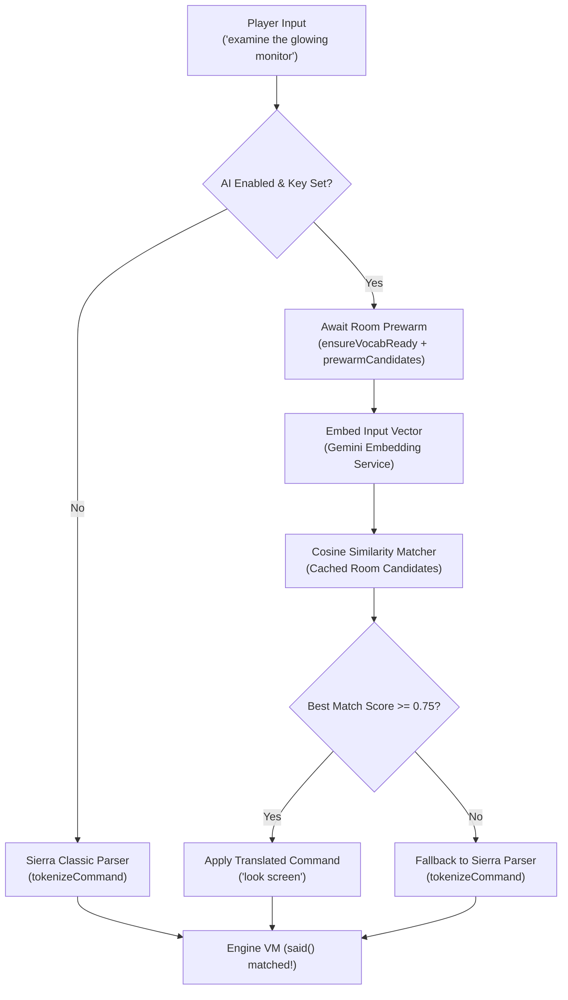

# AI Semantic Command Parser Architecture

This document describes the design, caching mechanisms, and lifecycle synchronization of the AI-assisted natural language command parser in the Sierra engine workbench, and outlines how this subsystem will be extended from AGI to SCI (SCI0 / SCI1-EGA).

---

## 1. Overview & Goal

Classic Sierra adventure games require strict text input matching predefined vocabulary words and phrase structures (e.g. `said("look", "screen")`). Players often struggle with vocabulary guessing (synonym hunting, typing colloquialisms like *"could you please examine the terminal monitor"* or *"pet kitty"*).

The AI Semantic Parser provides **hybrid natural-language understanding**:
1. It statically extracts all valid command patterns (`said(...)`) present in the active room and global scripts.
2. It expands these patterns using semantically deduplicated game vocabulary into candidate phrases.
3. It maps the player's natural language input to high-dimensional embedding vectors using the Google Gemini Embeddings API (`text-embedding-004` or `gemini-embedding-001`).
4. It performs cosine similarity matching. If a candidate exceeds the similarity threshold (default `0.75`), it translates the player's input into the exact syntax the Sierra VM expects.
5. If no candidate meets the threshold, it seamlessly falls back to Sierra's classic parser (`tokenizeCommand`).



---

## 2. Core Subsystems

### 2.1 Vocabulary Deduplication (`AiDiskCache.vocab.json`)
- Sierra's vocabulary files (`WORDS.TOK` in AGI, `VOCAB.000` in SCI) map synonyms to numeric word group IDs.
- However, Sierra synonym groups are often noisy, broad, or overloaded (e.g. words with multiple distinct meanings lumped together).
- On initial game indexing, `geminiTranslator.deduplicateDictionary()` clusters synonyms per group ID, selecting 1–2 clean, distinct prototype words per slot.
- Stored as `<gameDirectory>/ai_cache/<model>/vocab.json` (~3 KB).

### 2.2 Said Extractor (`AgiSaidExtractor`)
- Traverses logic script bytecode ASTs to extract all `SaidInstruction` nodes.
- Expands slot synonyms into natural candidate phrases via Cartesian product:
  - Canonical phrase is always guaranteed first.
  - Candidate list per command is smoothly bounded by `maxCandidates` (default `15`), avoiding combinatorial explosion while preserving expressive synonym coverage.
- Combines `Logic 0` (global verbs/inventory), active room logic, and any dynamically loaded overlay scripts (e.g. KQ3 `Logic 104` for the cat).

### 2.3 Embedding Engine & Matcher (`EmbeddingService`, `SemanticMatcher`)
- Embeddings are generated in batches via Google GenAI.
- Candidate embeddings are cached in memory in an LRU/map cache for zero-latency lookups during gameplay.
- Normalized dot products yield cosine similarity in $[-1.0, 1.0]$.

---

## 3. On-Disk Persistence & Int8 Quantization

To avoid repeated API costs and rate limits, all embeddings are persisted in the game's folder under `<gameDirectory>/ai_cache/<model>/`:

```
<gameDirectory>/
  ai_cache/
    gemini-embedding-001/
      vocab.json              # Clean JSON of deduplicated vocabulary (~3 KB)
      logic_0.json.gz         # Int8-quantized + Gzipped candidates (~450 KB)
      logic_2.json.gz         # Int8-quantized + Gzipped room candidates (~130 KB)
      ...
```

### Int8 Quantization & Gzip Details
- **Quantization**: Because Gemini vectors are cosine unit-normalized ($\sum v_i^2 = 1.0$), each coordinate $v_i \in [-1.0, 1.0]$ is scaled to an 8-bit signed integer ($[-128, 127]$) via $(v_i \times 127.0).\text{round}()$.
  - Packed into an `Int8List` and serialized as Base64.
  - A 768-dimension vector shrinks from 17.3 KB of raw JSON float text down to 768 bytes (1,024 Base64 characters).
  - Dequantization scales by $1 / 127.0$ and re-normalizes to unit length.
  - Average cosine similarity error is **$\le 0.0026$**, ensuring zero degradation against the 0.75 threshold.
- **Gzip Compression**: Compresses payload with `gzip.encode` and writes `logic_<id>.json.gz`. Old uncompressed `.json` files are automatically deleted upon save.
- **Total Footprint Reduction**: **~97% space reduction** (e.g. `logic_0` reduced from 15 MB down to ~450 KB).

---

## 4. Lifecycle & Synchronization Guarantees

1. **Vocabulary-First Ordering (`ensureVocabReady`)**:
   - `prewarmCurrentRoomCandidates()` and `precomputeAllRoomCaches()` always await `ensureVocabReady()` before generating candidate phrases.
   - Prevents the startup race condition where `Logic 0` was previously extracted and embedded before vocabulary deduplication had finished.
2. **Overlay Logic Scripts Tracking**:
   - Sierra games dynamically load helper scripts for NPCs or mini-games (stored in `_loadedLogicNumbers`).
   - `AgiSaidExtractor.extractActiveRoomCommands()` accepts `additionalLogics` and merges overlay script `said(...)` specifications into the active candidate pool.
   - Dynamic loading (`loadLogic`) triggers an automatic background pre-warm for newly loaded scripts.
3. **No Early Bypass**:
   - `submitCommand` awaits in-flight room prewarm futures before evaluating semantic similarity. Player input submitted immediately upon room transition will wait for candidate readiness rather than bypassing AI.

---

## 5. Extending to SCI (SCI0 & SCI1-EGA)

The core AI translation stack is engine-agnostic and designed for direct reuse in SCI:

| Component | AGI Implementation | SCI0 / SCI1-EGA Counterpart | Reusability |
|---|---|---|---|
| **Embeddings & Client** | `EmbeddingService` | Shared directly | **100% Shared** |
| **Semantic Matcher** | `SemanticMatcher` | Shared directly | **100% Shared** |
| **Disk Cache & Int8 Gzip** | `AiDiskCache` | Shared directly (`ai_cache/<model>/`) | **100% Shared** |
| **Translator Orchestrator** | `GeminiCommandTranslator` | Shared directly | **100% Shared** |
| **Vocabulary Source** | `WORDS.TOK` via `AgiDictionary` | `VOCAB.000` via `SciDictionary` | Sibling dictionary parser mapping words to group IDs |
| **Command Pattern Extraction** | `AgiSaidExtractor` (AGI AST bytecode) | `SciSaidExtractor` (SCI Said-spec bytecodes) | Specialized extractor for SCI Polish-notation `Said` specs |
| **Engine Hook** | `AgiGameEngine.submitCommand` | `SciGameEngine.handleInput` / kernel `kParse` | Similar async prewarm & command injection |

### SCI-Specific Implementation Plan (`SciSaidExtractor`):
1. **Said Specs in SCI0**:
   - In SCI0, `said(...)` tests are evaluated via kernel calls `kParse` and `kSaid`.
   - The arguments to `Said` in SCI bytecode are byte-packed Polish notation expression trees (e.g. `[0x01, wordGroupLow, wordGroupHigh, ...]`, with operators for AND, OR, ANY, and ROL).
2. **Script Architecture**:
   - SCI maintains a global `Script 0` (analogous to AGI `Logic 0`) and room scripts.
   - Instead of scanning all bytecodes, `SciSaidExtractor` can inspect event handlers (`handleEvent:`) on `Feature`, `Actor`, and `Room` instances or scan the script's `Said` spec strings.
3. **Dictionary (`VOCAB.000`)**:
   - `VOCAB.000` defines word strings, word classes (noun, verb, preposition), and word group IDs.
   - The same Gemini vocabulary deduplication clustering will prune `VOCAB.000` synonym groups into clean prototypes stored in `vocab.json`.
